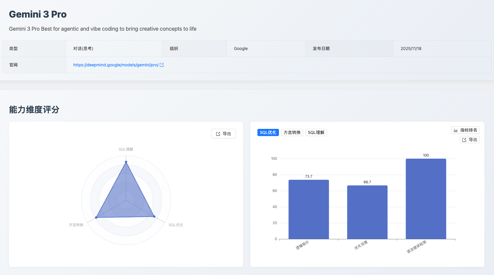
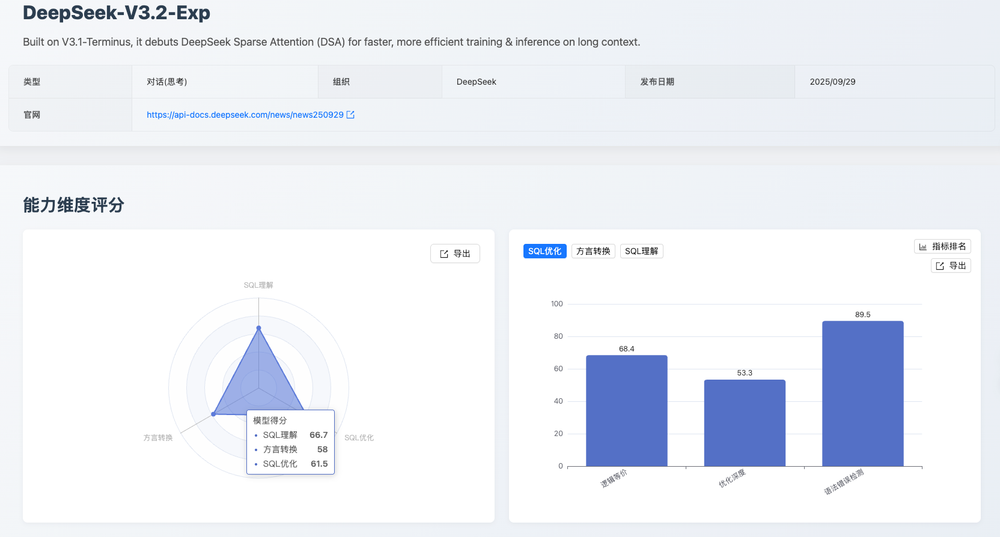

SCALE文档11月版本

SCALE AI模型SQL能力评测：2025年11月发版总览

一、发版摘要与核心价值

本期 SCALE 评测聚焦于新一代专业级大语言模型在数据库 SQL 领域的表现边界。发版核心内容为 Gemini 3 Pro 和 DeepSeek-V3.2-Exp 两大顶尖模型的首次深度测评报告，旨在为用户提供最前沿、最可靠的技术选型依据。

核心看点速览：

可靠性新标杆：Gemini 3 Pro 模型首次参评，在 SQL 理解能力 维度以 86.0分 领跑榜单，确立了其在复杂逻辑解析上的业内领先地位。

国产化潜力股：DeepSeek-V3.2-Exp 模型首次入榜，其在 国产数据库转换 方面表现出强劲潜力（92.1分），为国产化替代场景提供了新的高性能选择。

二、评测目的、背景与方法论

本次测评旨在系统性评估两大模型在企业级复杂数据库场景下的实用性。我们严格遵循 SCALE 框架自创立以来的三大核心维度和统一评测数据集，确保结果的公正性与可复现性。

点击图片可查看完整电子表格

三、专题深度测评 I：Gemini 3 Pro 评测报告

3.1 核心结论速览

Gemini 3 Pro 的能力分布呈现出“深度理解、高质优化、均衡转换”的显著特征。其 SQL 理解能力 取得榜单首位（86.0分），优化后 SQL 语法正确性 达 100 分，是面向企业级、高可靠性要求的数据库任务的理想 AI 助手。

3.2 维度详细表现与数据洞察

点击图片可查看完整电子表格

3.3 关键挑战与数据分析

评测中发现，Gemini 3 Pro 的主要挑战集中在对数据库底层机制的精细理解和结构化输出的严格规范性上。

SQL 理解维度：执行计划解析缺陷

语义混淆：模型在结构化输出中未能严格遵循规范，将 JSON 的 null 值错误输出为字符串 "NULL"，导致 SQL 语义中的 NULL 与 JSON 数据类型规范发生混淆。

写操作误判：在执行计划检测中，模型对数据库写操作（UPDATE/DELETE）的语义理解不足，未能识别 MySQL 优化器会使用主键索引进行行定位的优化行为，错误地将应使用索引扫描的 UPDATE 操作误判为全表扫描（type: "ALL"）。

SQL 优化维度：模式识别与策略应用不足

模式识别缺陷：未能识别 LIKE 前缀查询模式可改写为范围查询以利用索引有序性，限制了在特定查询场景下的性能提升。

冗余消除不足：未能识别并消除无 LIMIT 子查询中的冗余 ORDER BY 操作，反映出模型在细粒度语义分析和规则消除方面的不足。

类型转换盲区：未能识别 DATE 字段与字符串比较时可能发生的隐式类型转换问题，这可能在生产环境中导致性能下降。

方言转换维度：国产数据库知识短板

知识性错误：在处理 Oracle 的 CAST 语法时，模型错误地将其替换为 OceanBase（Oracle 模式）不支持的 COLLECT 聚合函数，反映出模型对于国产数据库的知识储备不足，更倾向于机械转换而非基于目标环境特性进行语义等价性判断。

3.4 应用建议与价值体现

点击图片可查看完整电子表格

四、专题深度测评 II：DeepSeek-V3.2-Exp 初始评测报告

4.1 核心结论速览

Deepseek-v3.2-exp 在本期评测中展现了明显的能力聚焦。其在 国产数据库转换 子项上取得了92.1分的优异成绩，使其成为国产化替代路径中具有突出价值的工具。然而，其在复杂逻辑处理和优化深度上的不足表明，它更适用于特定领域的辅助工作。

4.2 维度详细表现与数据洞察

点击图片可查看完整电子表格

4.3 关键挑战与数据分析

评测中发现，DeepSeek-V3.2-Exp 的主要挑战集中在对数据库底层机制的精细理解、SQL优化模式识别以及跨方言语义等价转换的准确性上。

SQL 理解维度：执行计划解析缺陷

写操作语义混淆：模型在处理 INSERT/REPLACE 操作时，错误地返回了具体的执行计划信息（type: "INSERT", rows: "1"），而 MySQL 的 EXPLAIN 对于写操作应返回 type: "ALL" 且 rows、Extra、filtered 等字段均为 null，反映出模型对写操作执行计划输出规范的理解偏差。

写操作索引使用误判：在执行计划检测中，模型对数据库写操作（UPDATE）的语义理解不足，未能识别 MySQL 优化器会使用主键索引进行行定位的优化行为，错误地将应使用索引扫描的 UPDATE 操作返回为 type: "UPDATE" 而非 type: "index"。

过滤比例计算偏差：在处理 DELETE 操作时，模型返回 filtered: "33.33" 而预期应为 100，反映出模型对 WHERE 条件过滤比例计算逻辑的理解不足。

SQL 优化维度：模式识别与策略应用不足

模式识别缺陷：未能识别 LIKE 前缀查询模式可改写为范围查询以利用索引有序性，限制了在特定查询场景下的性能提升。

类型转换盲区：未能识别 DATE 字段与字符串比较时可能发生的隐式类型转换问题，即使已提供 DDL 信息，模型仍未能检测出潜在的隐式转换风险，这可能在生产环境中导致性能下降。

谓词下推优化遗漏：在包含多层嵌套子查询的场景中，模型未能识别可以将过滤条件下推到更内层查询以减少中间结果集大小的优化机会。

方言转换维度：语义等价性与语法准确性不足

逻辑错误：在 Oracle 转 PostgreSQL 的转换中，模型将 v_rows_updated := v_rows_updated + SQL%ROWCOUNT 错误转换为 v_rows_updated := v_rows_updated + v_rows_updated，导致累加逻辑完全失效，反映出模型在跨方言语义映射时的注意力机制缺陷。

类型系统理解偏差：模型在转换 Oracle 的 TYPE t_sales_summary IS RECORD 时，直接保留了类似的语法结构，但 PostgreSQL 9.2 不支持显式定义 RECORD 结构，RECORD 类型只能通过 SELECT INTO 或 FOR 循环隐式确定结构，反映出模型对目标数据库类型系统的理解不足，更倾向于机械转换而非基于目标环境特性进行语义等价性判断。

不兼容语法残留：在 SQL Server 转 GaussDB 的转换中，模型保留了 SET NOCOUNT=ON 语句，但 GaussDB 不支持该语法，反映出模型对目标数据库语法约束的理解不充分。

函数映射错误：在 SQL Server 转 GaussDB 的转换中，模型使用了 GET DIAGNOSTICS v_cursor_status = CURSOR_STATUS，但 GaussDB 的 GET DIAGNOSTICS 不支持 CURSOR_STATUS 诊断项，反映出模型对目标数据库系统函数和诊断机制的理解不足。

4.4 总结与应用建议

总体结论： DeepSeek-V3.2-Exp 的能力分布呈现出明显的专业领域聚焦。其核心优势在于对 SQL 规范性的严格遵守（理解维度 84.3分）和 国产数据库迁移的针对性支持（转换维度 92.1分）。虽然在性能优化深度和复杂场景上仍有提升空间，但其高分的针对性能力使其在国产化替代项目中具有显著的辅助价值。

应用建议：

点击图片可查看完整电子表格

五、未来展望与行动号号

SCALE 评测体系将持续跟踪各大厂商的最新模型动态和迭代进展。我们致力于通过公正、透明的评测数据，与社区共同推动大语言模型在数据库领域的应用和实践走向更深层次。

即刻探索新一代模型的专业能力！ 欢迎您登陆 SCALE 官方平台，查看完整的最新榜单和模型对比详情，共同把握 AI 技术的前沿脉搏。