SCALE文档12月版本

SCALE 测评框架 2025年12月版本说明：生产级 SQL 评测基准的深度演进

一、 本月导览

2025年12月，SCALE 完成了核心数据集和榜单模型的迭代。本月更新的核心价值在于：SQL 调优维度测评数据集 2.0 正式上线。该版本标志着评测基准从学术化 SQL 调优，全面转向对“生产级复杂性”场景的真实模拟。

与此同时，本月完成了针对 GPT-5 系列、Claude 4.5 系列及蚂蚁百灵 Ling-2.0-Flash 等新一代模型的首发评测。我们旨在通过严苛的基准数据集，为企业技术决策者提供模型 SQL 能力具备落地价值的参考。

二、 评测基准升级：SQL 调优数据集 2.0

为系统化评估大语言模型（LLM）在真实生产环境复杂业务逻辑处理中的实战能力，我们对 SQL 调优维度的评测数据集进行了体量扩充和难度升级。

1. 生产级复杂性维度定义

新版数据集摒弃了理想化的语法改写，聚焦于解决生产环境中的真实性能瓶颈：

高阶算子与复杂函数适配：深度覆盖窗口函数（Window Functions）、嵌套聚合、递归 CTE 及特定数据库引擎的高级特性算子。

大规模关联与长上下文：测试用例涉及平均 5-10 张物理表关联，单条 SQL 长度普遍超过 100 行，重点考察模型在长文本环境下的语义锚定能力。

逻辑链路重构能力：通过多层嵌套结构，验证模型对执行路径的重排能力及对临时逻辑链路的解构效率。

高保真业务语义：用例来源于金融清算、电商核算等脱敏真实业务，要求模型在理解深层业务意图的基础上进行逻辑等价优化。

2. SQL 优化分项指标表现

基于强化后的数据集，我们通过三个核心技术子维度量化模型在数据升级后的真实表现：

逻辑等价

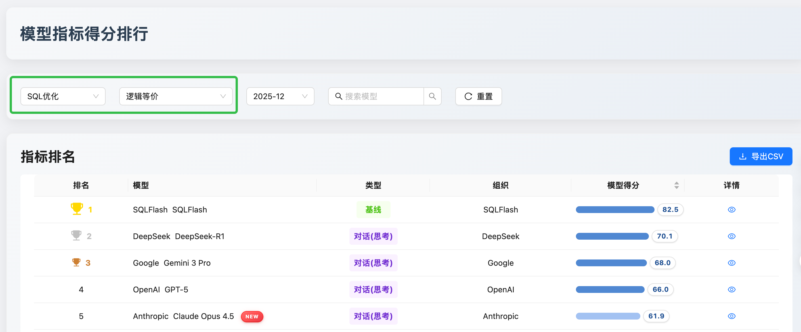

优化深度

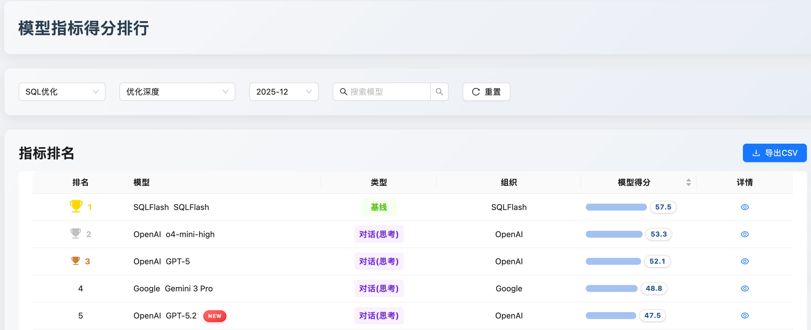

语法错误检测

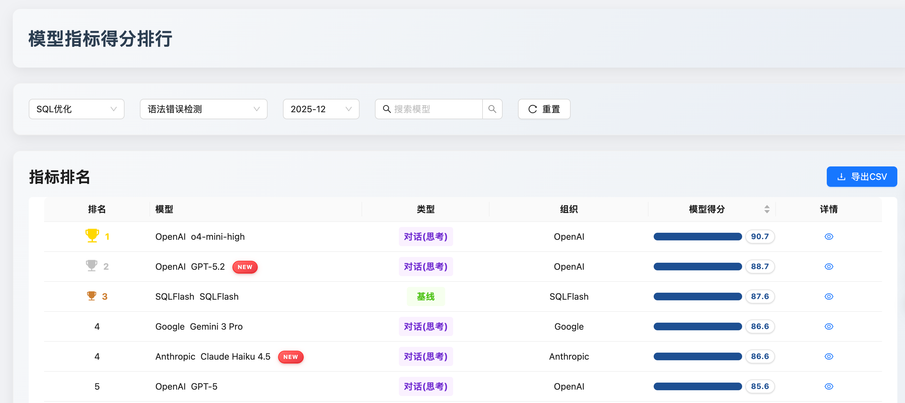

SQL 优化维度测评总结：

技术分层显著化：在生产级复杂任务下，GPT-5.2 与 Claude Opus 4.5 展现了代际领跑优势。特别是在“规则深度”维度，GPT-5.2 展示了卓越的物理代价评估能力。

路径差异化竞争：OpenAI 阵营倾向于“执行效率”与重写深度；Anthropic 阵营则在“语义保真度”上达到极致；SQLflash 则通过 MoE 架构在执行准确性与效能平衡上开辟了新赛道。

工业熟化判定：GPT-5.2 具备最高的综合生产就绪度。而 SQLflash 则在“语法安全性”与“执行合规性”上展现了极高的工业级底色，是构建安全审计防火墙的理想选择。

三、 核心厂商模型技术解析

1. OpenAI：聚焦执行计划的物理优化专家

GPT-5.2：

能力核心：具备卓越的物理执行计划洞察力，不仅能进行等效语义改写，更能主动识别隐式转换、索引失效等底层痛点，干预执行路径（如建议 Hash Join）。

业务价值：显著降低生产环境慢查询风险，生成的 SQL 符合金融级合规标准，执行准确率达 95.5%，极大减少 DBA 的人工审核成本。

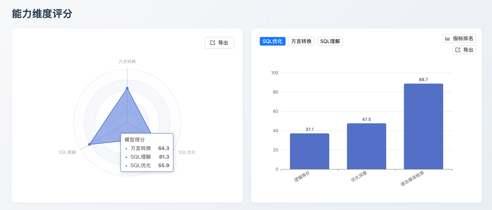

GPT-5.1：

能力核心：专注于激进的结构化重构，擅长将老旧系统的复杂子查询扁平化，消除冗余关联，降低系统负载。

业务价值：实测数据显示执行时延平均降低 30% 以上，是存量老旧系统代码现代化与性能压测达标的首选模型。

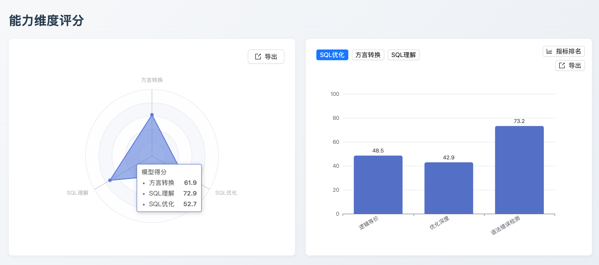

2. Anthropic：语义保真与复杂逻辑解构的基准

Claude Opus 4.5：

能力核心：逻辑一致性的代际标杆，目前唯一能稳定处理 10 层以上 CTE 嵌套且保证逻辑零偏差的模型，语境锚定与语义解构精度极高。

业务价值：在高敏感的财务核算、核销逻辑等容错率为零的场景下，提供极高的逻辑保真度（99.5 分），杜绝因改写导致的业务结果偏差。

Claude Sonnet 4.5：

能力核心：全能型迁移底座，对不同数据库方言间的变量作用域、临时表生命周期等底层细节掌控极其细腻。

业务价值：具备极高的转换稳定性与长期维护性，是构建企业级自动化迁移流水线、处理大规模 DDL/DML 迁移的最佳平衡方案。

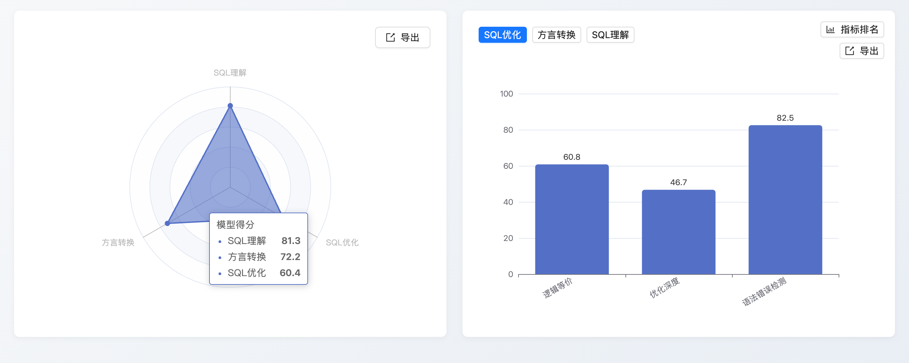

Claude Haiku 4.5：

能力核心：极低延迟下的高精度语法诊断，能在毫秒级响应中提供优于前代旗舰的纠错能力。

业务价值：显著提升 IDE 插件集成及实时 SQL Linting 的用户体验，在保证低计算成本的同时维持开发辅助的高可靠性。

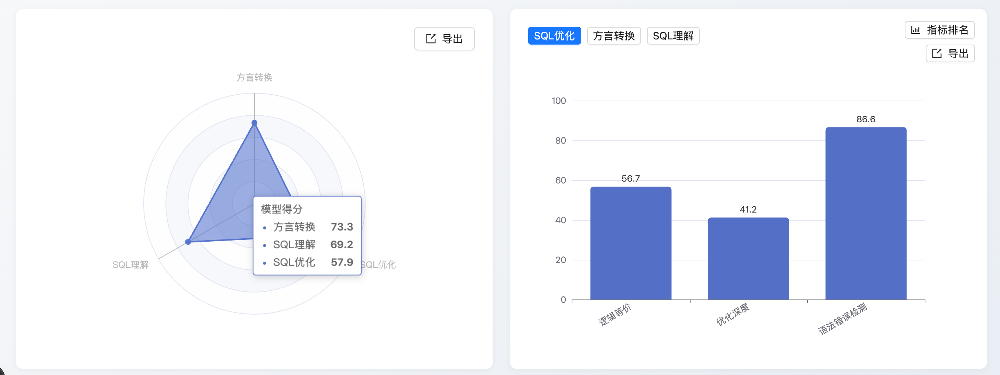

3. 蚂蚁百灵：信创生态适配与审计领跑者

Ling-2.0-Flash：

能力核心：针对国产数据库生态（如 OceanBase Oracle 模式）底层协议与方言特性的原生对标，具备极致的 MoE 参数激活策略。

业务价值：信创国产化替代场景下的核心引擎，显著降低跨数据库迁移的适配成本，在处理存储过程等高级对象时表现亮眼。

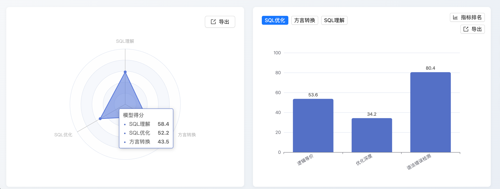

四、 评测模型变更日志

1. 新增评测模型

Claude 4.5 系列：Opus、Sonnet、Haiku 全量进入评测矩阵。

OpenAI 系列：GPT-5.1、GPT-5.2 正式版本。

蚂蚁百灵系列：Ling-2.0-Flash (MoE 架构)。

2. 存量模型升级与快照更新

o4-mini-high：替换旧版版本，显著提升了多表关联场景下的逻辑收敛性。

GPT-5 统一快照：将所有实验分支统一更新为 12 月最新的 Snapshot 版本，确保评测的一致性。

DeepSeek-V3.2 正式版：由实验版 (Exp) 切换至生产稳定版，重点针对 Oracle 语法下的幻觉问题进行了针对性修复。

五、 三大核心维度综合榜单

基于 SCALE 2.0 评测标准，本月模型在各维度的性能排布如下：

1. SQL 优化能力榜

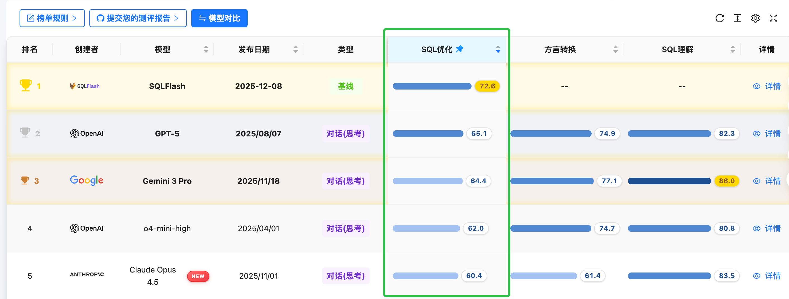

2. SQL 方言转换榜

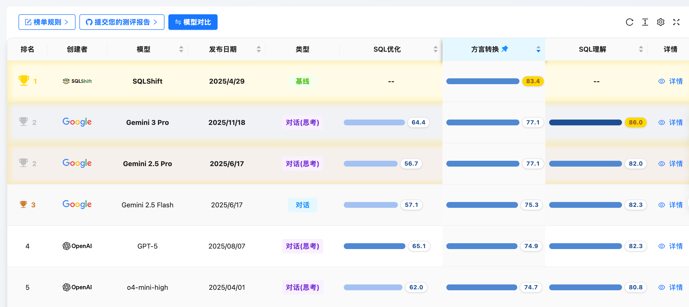

3. SQL 理解能力榜

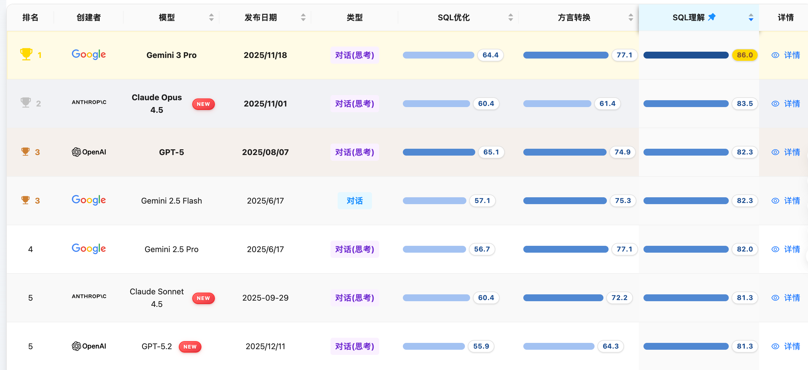

六、 结论与推荐部署矩阵

根据 SCALE SQL优化数据集2.0 的实战评测得分，我们建议用户按需选择部署方案：

生产环境慢 SQL 性能调优：首选 GPT-5.2，利用其在物理层执行路径的深度优化能力。

复杂核心业务逻辑迁移：首选 Claude Opus 4.5，确保在跨库迁移中的极致逻辑一致性。

信创国产化替代场景：推荐部署 Ling-2.0-Flash，其针对国产化数据库的专向适配能显著缩短迁移周期。

高频实时 SQL 审计与校验：首选 Claude Haiku 4.5 或 Ling-2.0-Flash，在极低时延下提供高可靠的语法诊断。

立即体验： 欢迎登录 SCALE 官网获取详尽的技术白皮书及完整模型跑分矩阵。