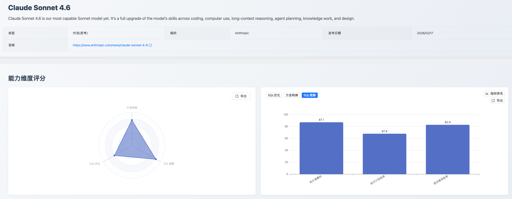
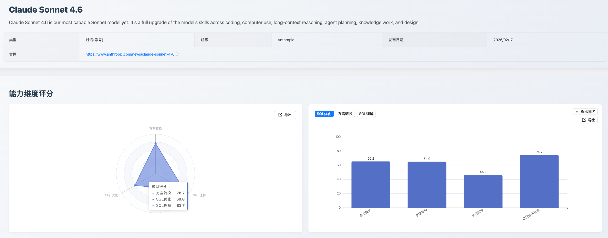
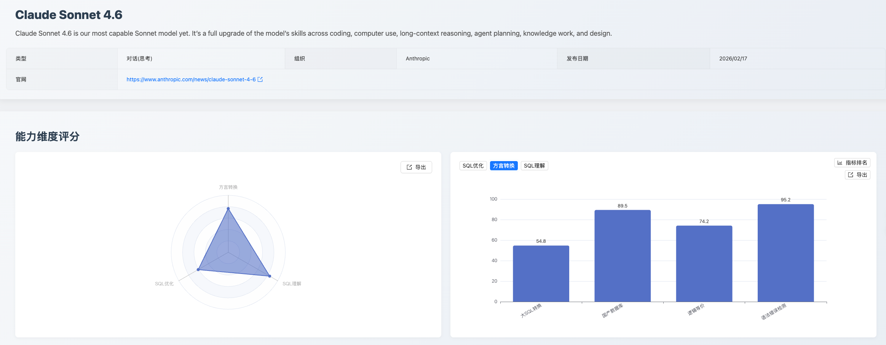
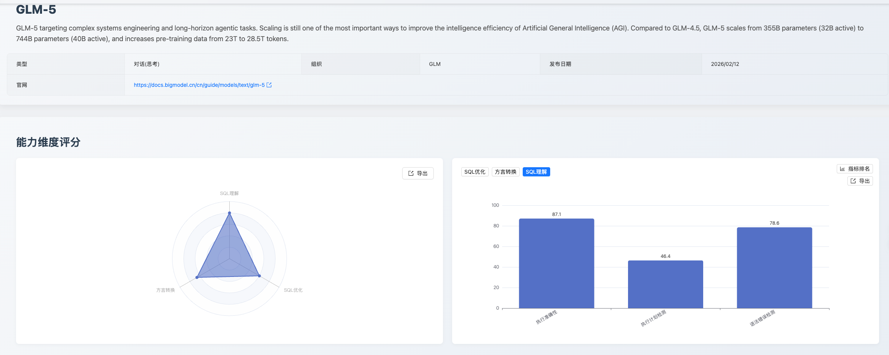
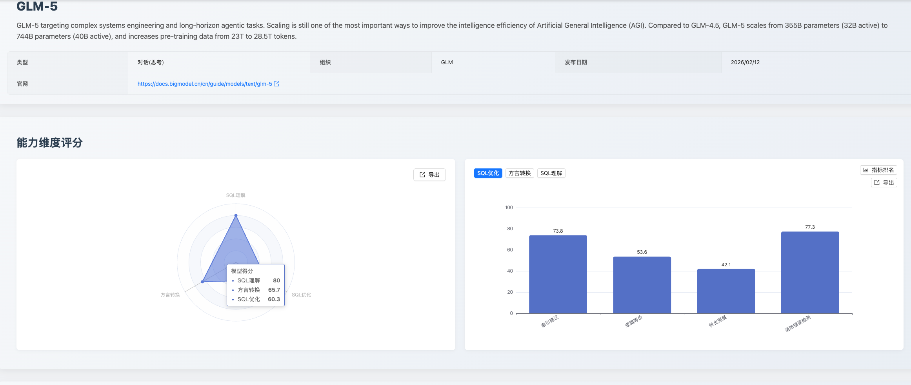
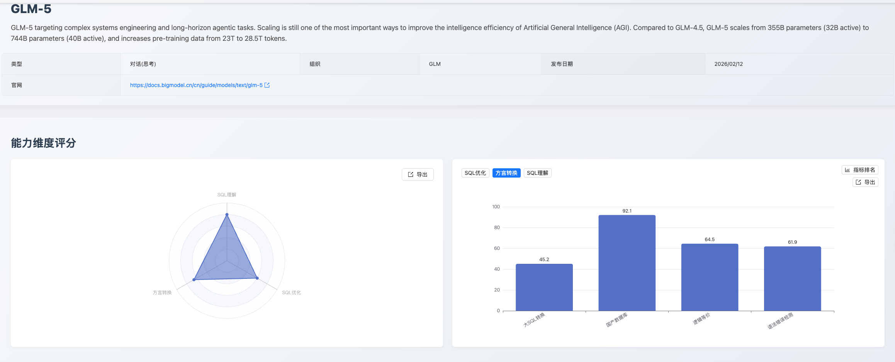
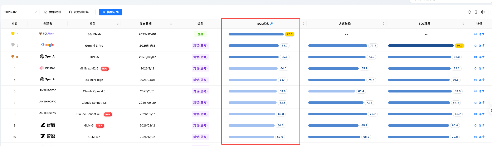
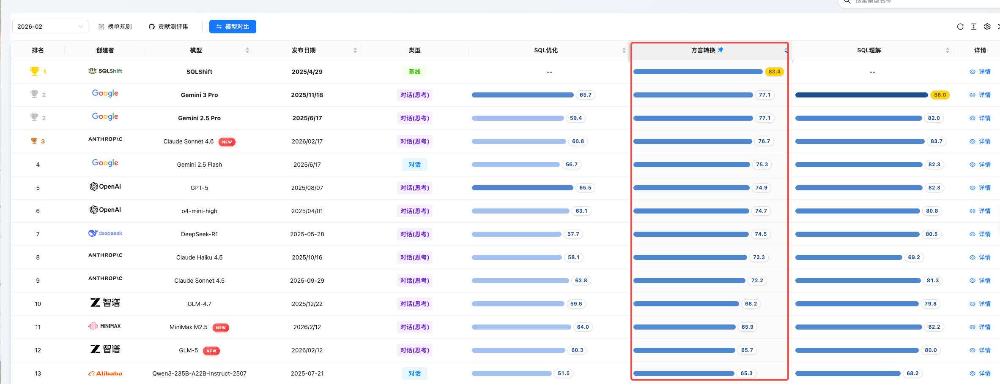
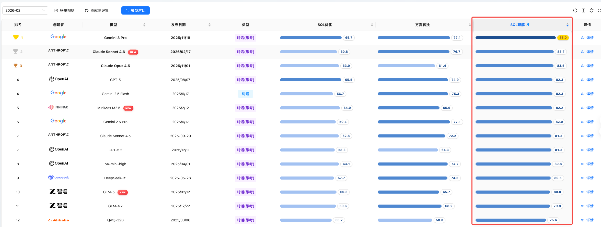

SCALE 2026年2月版本

# SCALE 测评框架 2026年2月版本说明：新增模型测评与综合榜单更新

## 一、发版摘要与核心价值

本月，SCALE 测评框架迎来重要更新，正式纳入 Anthropic 的 **Claude Sonnet 4.6**、智谱的 **GLM-5** 以及 MiniMax 的 **MiniMax M2.5** 三款行业领先大模型。此次发版致力于为用户提供更全面、及时的模型能力洞察，特别是在 SQL 理解、SQL 优化和方言转换这三大核心维度上，我们通过深度测评，揭示了各模型的优势与潜力。同时，最新的综合榜单也已同步更新，为模型选型与应用提供最新数据支撑。

## 二、评测方法论

本次评测严格遵循 SCALE 的三大核心维度和统一评测数据集，SCALE 测评自创立以来一直秉持的三大核心维度和统一的评测数据集，确保所有数据均在同等严格的标准下进行评估，以保障评测结果的公正性和可复现性：

1. **SQL理解 (SQL Understanding)**：评估模型对现有 SQL 代码的逻辑、意图和执行计划的深度分析能力，测评指标包括执行准确性、执行计划推理、语法错误检查。
2. **SQL优化 (SQL Optimization)**：评估模型在保证逻辑等价和语法正确的前提下，将低效 SQL 改写为性能更优查询的策略应用和效果，以及对SQL推荐索引的能力，保障可落地、性价比合理、风险可控的优化方案。测评指标包括逻辑等价性检测、优化深度、语法错误检测、索引建议。
3. **方言转换 (Dialect Conversion)**：评估模型在不同数据库方言之间进行语法迁移和复杂过程化逻辑重构的准确性和可靠性。测评的指标包括大SQL转换、国产数据库、逻辑等价性检测、语法错误检测。

## 三、专题深度测评

### 3.1 专项测评：Claude Sonnet 4.6 (Anthropic)

**1. 能力定位判断**

Claude Sonnet 4.6 在本次测评中展现出均衡全面的 SQL 能力与卓越的语法纠错水准。它不仅仅是一个代码生成工具，更像是一个具备严谨语法审查意识的"高级 SQL 审计员"，在方言转换与执行计划分析方面展现了第一梯队的实力。

**2. 核心维度分析**

*   **SQL 理解 (得分 83.7)**：表现出优秀的综合理解力。其执行计划检测（67.9）高居榜首，意味着模型能够深入分析查询的执行路径、识别潜在性能瓶颈，这在复杂查询调优场景中极具价值。执行准确性（87.1）与语法错误检测（82.9）同样出色，体现了模型对 SQL 语义和规范的深层理解。

*   **SQL 优化 (得分 60.8)**：模型在逻辑等价（64.9，第5位）和索引建议（65.2，第7位）方面表现稳健，能够进行有效的等价改写并提供合理的索引优化方案。但在优化深度（48.2，第8位）上仍有提升空间，面对多表连接、复杂子查询等深层优化场景时，策略生成能力有待加强。

*   **方言转换 (得分 79.7)**：这是 Claude Sonnet 4.6 的传统强项，语法错误检测得分高达 95.2 分，高居榜首，展现出对不同数据库方言语法规则的精确掌握。国产数据库转换（88.5，第5位）和逻辑等价（74.2，第5位）表现均衡，大SQL转换（54.8，第5位）也处于前列，整体方言迁移能力十分可靠。

**3. 应用价值建议**

*   **推荐场景**：适用于 SQL 代码审查与语法纠错、执行计划分析与性能诊断、数据库异构迁移（特别是信创环境）。
*   **实战建议**：可作为 SQL 质量门禁的核心引擎，在 CI/CD 流程中集成语法检查和方言转换校验；在深层性能优化方面，建议配合 DBA 人工审核以弥补优化深度的不足。

### 3.2 专项测评：GLM-5 (智谱)

**1. 能力定位判断**

GLM-5 在本次测评中展现出极高的逻辑严谨性与场景适应性。它不仅仅是一个 SQL 生成器，更像是一个具备初步工程思维的"初级 DBA"，在索引优化建议与国产化迁移时展现了第一梯队的稳定性。

**2. 核心维度分析**

*   **SQL 理解 (得分 80.0)**：表现出较强的逻辑一致性。其执行准确性（87.1）得分较高，意味着模型能够准确理解复杂的业务意图。但在执行计划检测中（46.4，第7位），模型对聚合排序操作的执行机制理解不足，以及在多表关联场景下对驱动表和执行步骤的推理能力欠缺。

*   **SQL 优化 (得分 60.3)**：在索引建议指标中，模型取得了 73.8 分的成绩，高居榜首。整体来看，模型已能够结合查询条件给出符合索引设计基本原理的优化建议，初步具备了基于执行计划进行分析并提出物理结构优化方案的能力。但在更复杂的场景下，尤其是涉及索引冗余判断以及低选择性列与索引维护成本之间权衡的问题时，模型的表现仍不稳定。

*   **方言转换 (得分 65.7)**：国产数据库转换得分高达 92.1 分（第4位），这是 GLM-5 的传统强项，表现出较高的成熟度。但在语法正确性检测评评上得分为 61.9，处于较低水平，反映出模型在细粒度方言知识掌握上的显著不足，特别是对特定数据库版本（如 OceanBase 4.2.5、GaussDB-v2.0_3.x）的语法约束、数据类型支持范围缺乏准确认知。

**3. 应用价值建议**

*   **推荐场景**：适用于企业级遗留系统重构、复杂业务 SQL 开发辅助、数据库国产化迁移专项。
*   **实战建议**：可用于生成迁移脚本的参考初稿，但在索引建议方面，建议作为 DBA 审查的"第一道参考"，在生产环境部署前仍需配合 Explain Plan 进行微调。

### 3.3 专项测评：MiniMax M2.5 (MiniMax)

**1. 能力定位判断**

MiniMax M2.5 在本次测评中展现出精准的 SQL 理解力与稳健的优化能力。它更像是一个兼具纠错意识和优化直觉的"全能型 SQL 助手"，在语法检测、优化深度和国产数据库适配方面均展现出明确的竞争力。

**2. 核心维度分析**

*   **SQL 理解 (得分 82.2)**：整体表现优秀。执行准确性（87.1，并列第2名）展现了对 SQL 执行路径和语义判断的出色把控力。语法错误检测（82.9）进一步体现了模型对 SQL 语法规范的精准理解。执行计划检测（57.1）尚有提升空间，随着模型对数据库优化器行为的进一步学习，该项能力有望增强。

*   **SQL 优化 (得分 64.0)**：在多个子项上展现出亮眼表现。优化深度获得并列第2名（53.3），表明模型在深层次 SQL 优化策略上具备显著竞争力。语法错误检测高达 85.6分（并列第5名），为改写输出的可靠性提供了保障。索引建议（66.2，并列第6名）展现了实用价值。逻辑等价（56.7）在复杂改写场景下的语义一致性保持方面仍有优化空间。

*   **方言转换 (得分 65.9)**：呈现出鲜明的差异化优势。国产数据库转换获得 88.5分（并列第5名），展现了对 OceanBase、GaussDB 等国产数据库方言的深度适配能力，在信创迁移背景下极具战略价值。逻辑等价（74.2）和语法错误检测（71.4）表现稳健。大SQL转换（41.9）在处理超长复杂脚本场景下仍有成长空间。

**3. 应用价值建议**

*   **推荐场景**：适用于日常 SQL 开发辅助与语法纠错、国产数据库生态迁移、SQL 性能优化辅助。
*   **实战建议**：可作为 IDE 集成的实时 SQL 校验工具，也可在信创迁移项目中作为方言转换的核心引擎；在深层优化场景中，其优化深度排名第2的优势可辅助团队快速定位优化方向，对于超长复杂脚本建议搭配人工审核。

## 四、评测模型变更日志

### 新增评测模型

本月 SCALE 评测框架新增以下三款大模型，进一步丰富了评测覆盖范围：

*   **Claude Sonnet 4.6** (Anthropic)
*   **GLM-5** (智谱)
*   **MiniMax M2.5** (MiniMax)

### 存量模型升级与快照更新

本月无存量模型升级与快照更新。

## 五、综合榜单

本章节呈现 SCALE 测评框架在 SQL 理解、SQL 优化和 SQL 方言转换三大核心维度上的最新综合榜单排名。这些榜单汇总了本月所有评测模型的整体表现，旨在为用户提供快速、全面的模型能力概览。

### SQL 理解能力榜

SQL 理解维度衡量模型对 SQL 语义、执行计划和语法规范的综合理解深度。本月新增的 Claude Sonnet 4.6 凭借执行计划检测的突出表现进入榜单第2位（83.7分），MiniMax M2.5 以 82.2分位列第6，GLM-5 以 80.0分排名第11。Google Gemini 3 Pro 继续以 86.0分领跑该维度。

### SQL 优化能力榜

SQL 优化维度考察模型在逻辑等价改写、深度优化策略、索引建议和语法纠错方面的综合能力。MiniMax M2.5 表现亮眼，以 64.0分位列第4，得益于其在优化深度子维度的突出排名（第2名）。Claude Sonnet 4.6 以 60.8分排名第8，GLM-5 以 60.3分紧随其后。SQLFlash 以 72.7分继续稳居该维度榜首。

### SQL 方言转换榜

方言转换维度评估模型在不同数据库方言间进行语法迁移和逻辑重构的准确性。Claude Sonnet 4.6 以 76.7分位列第4，其方言转换语法错误检测子维度更是以 95.2分高居榜首。MiniMax M2.5（65.9分，第11）和 GLM-5（65.7分，第12）在该维度表现接近，两者均在国产数据库转换方面展现出较强竞争力。SQLShift 以 88.4分继续领跑。

## 六、结论与推荐部署矩阵

本月新增的三款模型，Claude Sonnet 4.6、GLM-5 和 MiniMax M2.5，各自在 SQL 能力的不同维度展现出独特的优势。综合来看：

*   **对于需要卓越 SQL 语法纠错与执行计划分析能力的场景**：首选 **Claude Sonnet 4.6**，其在这些子维度上表现突出，能有效提升 SQL 质量和调试效率。
*   **对于数据库性能调优及国产化迁移的场景**：首选 **GLM-5**，其在索引建议和国产数据库转换方面表现卓越，是 DBA 和数据工程师的得力助手。
*   **对于通用 SQL 开发辅助与信创环境适配的场景**：推荐 **MiniMax M2.5**，其在 SQL 理解和国产数据库转换方面的均衡表现，使其成为多功能开发辅助和信创迁移的稳健选择。

SCALE 将持续关注大模型技术发展，不断优化评测体系，为用户提供最前沿、最精准的模型能力洞察。

欢迎登录 **SCALE 官方平台**，查看更详细的评测数据和报告，或体验模型测评实验室，进行专属定制化测评。

---
*数据截止时间：2026年2月评测周期*