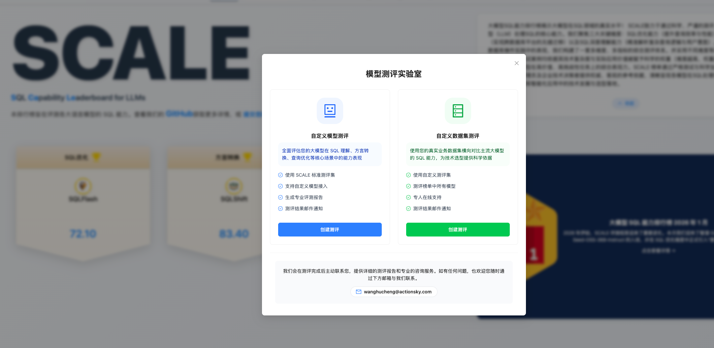
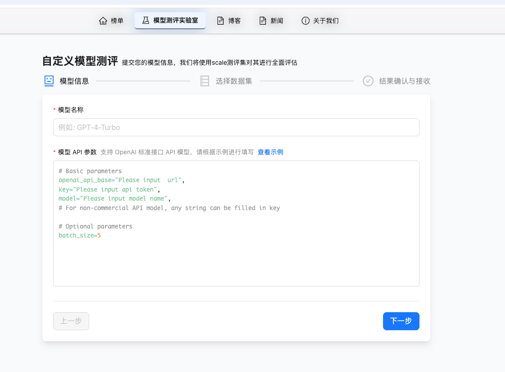
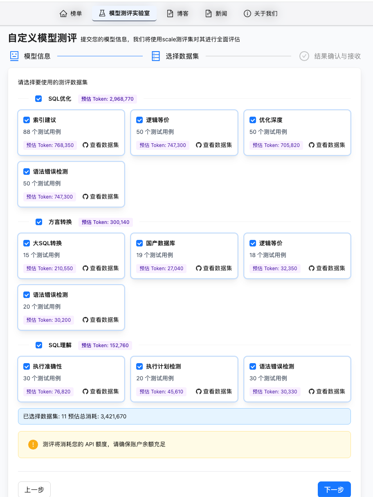
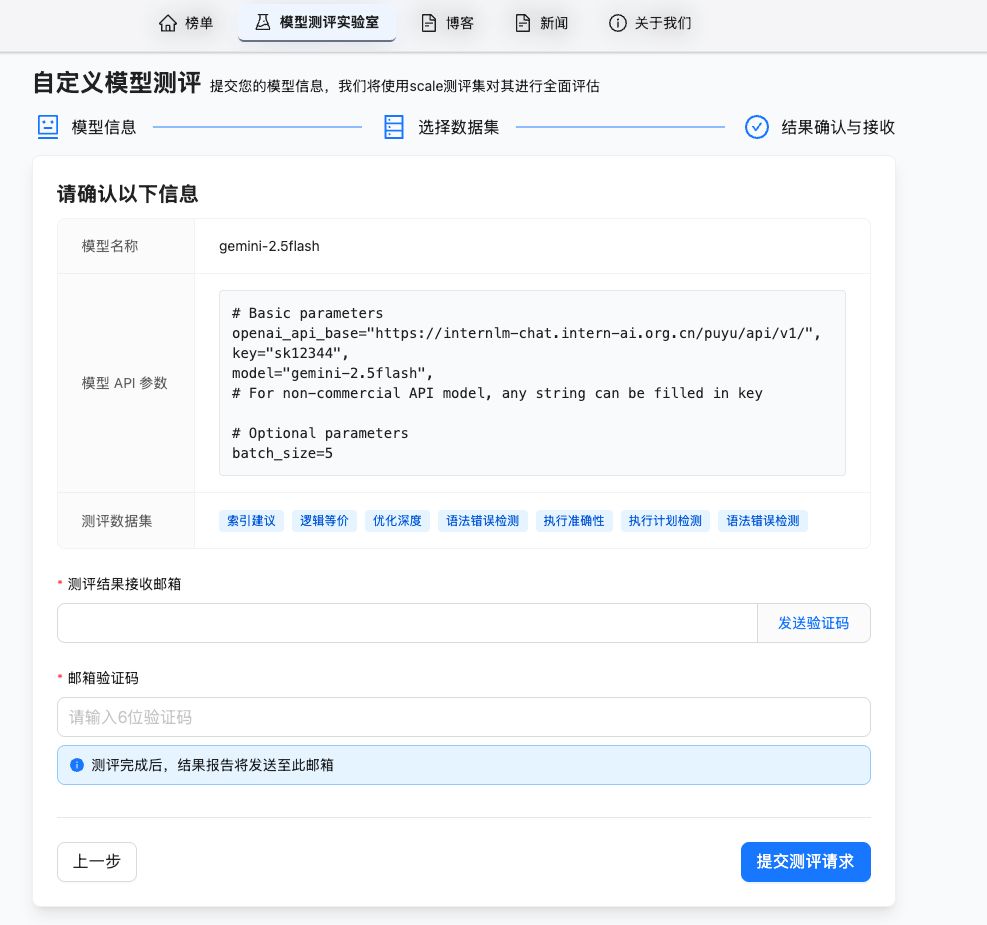
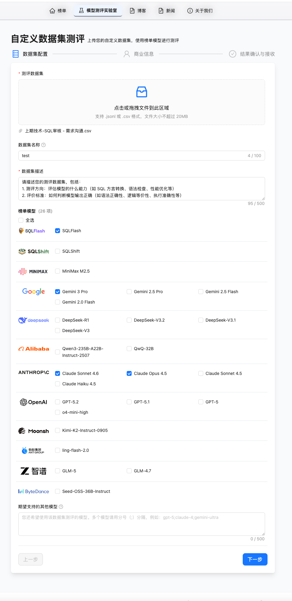
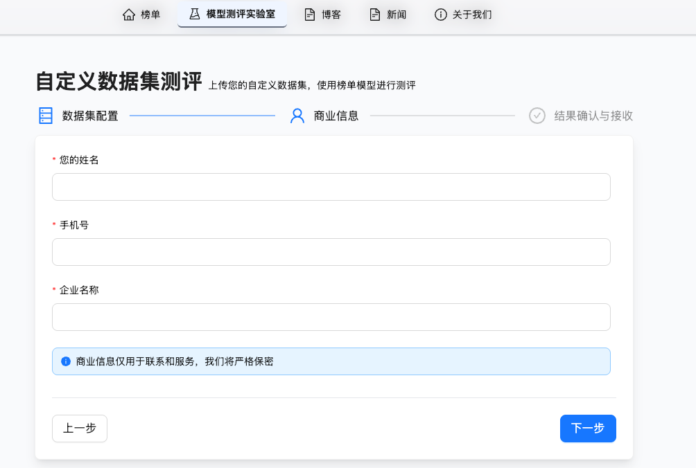

SCALE 2026年2月功能发版

# SCALE 平台新功能发布：模型测评实验室——让评测能力触手可及

## 一、发版摘要

2026年2月，SCALE 平台正式推出全新功能模块——**模型测评实验室**。该功能面向所有关注大模型 SQL 能力的技术决策者和开发者，提供两大核心能力：

- **自定义模型测评**：用户可配置自有模型 API，基于 SCALE 标准测评集，全面评估模型在 SQL 理解、SQL 优化、方言转换等核心维度的能力表现。
- **自定义数据集测评**：用户可上传自有业务数据集，横向对比 SCALE 榜单上所有主流模型的 SQL 能力，为技术选型提供贴合实际业务场景的科学依据。

模型测评实验室的发布，标志着 SCALE 从「官方评测排行榜」进化为「开放式评测平台」，让每位用户都能基于自身需求获取专属的测评洞察。

---

## 二、功能详解：自定义模型测评

### 2.1 功能定位

用户接入自有模型或私有部署模型的 API，使用 SCALE 官方数据集进行标准化测评，获得与榜单模型同等维度的能力评估报告。

### 2.2 操作流程

自定义模型测评采用三步式引导流程，简洁高效：

**第一步：填写模型信息**

用户提供模型名称及 API 参数。平台支持 **OpenAI 标准接口**格式，兼容绝大多数主流模型服务商。用户只需填写 `openai_api_base`、`key`、`model` 等基础参数即可完成接入，并可根据需要调整 `batch_size` 等可选参数。

**第二步：选择测评数据集**

平台提供覆盖 SCALE 三大核心维度的完整测评数据集，用户可按需灵活选择：

| 评测维度 | 子维度 | 测试用例数 |
|---|---|---|
| **SQL优化** | 索引建议 | 88 个 |
| | 逻辑等价 | 50 个 |
| | 优化深度 | 50 个 |
| | 语法错误检测 | 18 个 |
| **方言转换** | 大SQL转换 | 15 个 |
| | 国产数据库 | 19 个 |
| | 语法错误检测 | 20 个 |
| **SQL理解** | 执行准确性 | 30 个 |
| | 执行计划检测 | 20 个 |
| | 语法错误检测 | 30 个 |

平台会实时估算所选数据集的 **预估 Token 消耗**（如全选约 3,421,670 Tokens），帮助用户提前规划 API 额度。每个子维度均支持单独查看数据集详情。

**第三步：确认信息与接收结果**

用户确认模型参数和数据集选择后，填写接收邮箱并完成验证。测评完成后，专业评测报告将直接发送至指定邮箱。

### 2.3 核心价值

- **标准化对标**：使用与 SCALE 榜单一致的官方数据集，测评结果可与榜单模型直接横向对比，具备高度可参考性。
- **零门槛接入**：支持 OpenAI 标准接口，覆盖市面主流模型服务商，无需额外适配。
- **成本可控**：Token 消耗预估机制，让用户在测评前清晰了解成本，避免资源浪费。
- **专业报告输出**：测评完成后自动生成专业评测报告，邮件直达。

---

## 三、功能详解：自定义数据集测评

### 3.1 功能定位

用户上传贴合自身业务场景的真实数据集，使用 SCALE 榜单上的全部模型进行测评，获取针对特定业务需求的模型对比结果。

### 3.2 操作流程

**第一步：数据集配置与模型选择**

用户上传自定义测评数据集（支持 **jsonl** 或 **csv** 格式），并填写数据集名称和详细描述。平台建议用户在描述中明确：
1. **测评方向**：评估模型的什么能力（如 SQL 方言转换、语法检查、性能优化等）
2. **评价标准**：如何判断模型输出正确（如语法正确性、逻辑等价性、执行准确性等）

随后，用户可从 SCALE 榜单的 **26 个主流模型**中自由选择测评对象，涵盖：

| 厂商 | 可选模型 |
|---|---|
| SQLFlash | SQLFlash |
| SQLShift | SQLShift |
| MiniMax | MiniMax M2.5 |
| Google | Gemini 3 Pro、Gemini 2.5 Pro、Gemini 2.5 Flash、Gemini 2.0 Flash |
| DeepSeek | DeepSeek-R1、DeepSeek-V3.2、DeepSeek-V3.1、DeepSeek-V3 |
| Alibaba | Qwen3-235B-A22B-Instruct-2507、QwQ-32B |
| Anthropic | Claude Sonnet 4.6、Claude Opus 4.5、Claude Sonnet 4.5、Claude Haiku 4.5 |
| OpenAI | GPT-5.2、GPT-5.1、GPT-5、o4-mini-high |
| Moonshot | Kimi-K2-Instruct-0905 |
| 蚂蚁百灵 | ling-flash-2.0 |
| 智谱 | GLM-5、GLM-4-7 |
| ByteDance | Seed-OSS-36B-Instruct |

用户还可提交期望支持的其他模型，平台将根据需求持续扩展。

**第二步：填写商业信息**

用户填写姓名、手机号和企业名称。商业信息仅用于后续联系与服务，平台承诺严格保密。

### 3.3 核心价值

- **贴合真实业务**：基于用户自有数据集评测，结果直接反映模型在实际业务场景中的真实表现，避免"跑分高、落地差"的脱节问题。
- **全面横向对比**：一次测评即可覆盖 26 个主流模型，为技术选型提供一站式决策依据。
- **专人在线支持**：自定义数据集测评提供专人咨询服务，协助用户解读报告、优化选型方案。
- **持续模型扩展**：榜单模型持续更新，用户可随时获取最新模型的测评对比。

---

## 四、两大测评模式对比

| 对比维度 | 自定义模型测评 | 自定义数据集测评 |
|---|---|---|
| **适用场景** | 评估自有/私有部署模型的能力水平 | 基于业务数据选择最优模型 |
| **数据集** | SCALE 官方标准测评集 | 用户自定义上传 |
| **测评模型** | 用户自有模型（通过 API 接入） | SCALE 榜单全部 26 个模型 |
| **API 消耗** | 消耗用户自有 API 额度 | 由平台统一执行 |
| **结果交付** | 邮件发送专业评测报告 | 专人联系提供详细报告与咨询 |

---

## 五、总结与行动号召

模型测评实验室的推出，是 SCALE 平台从"评测内容发布"走向"评测能力开放"的重要一步。无论您是希望验证自研模型在 SQL 场景下的能力水平，还是希望基于真实业务数据为团队甄选最合适的模型方案，模型测评实验室都能为您提供专业、高效、可信赖的评测服务。

**立即体验**：欢迎登录 SCALE 官方平台，进入「模型测评实验室」，开启您的专属测评之旅。我们会在测评完成后主动联系您，提供详细的测评报告和专业的咨询服务。如有任何问题，也欢迎随时与我们联系。

---

*发布时间：2026年2月*

