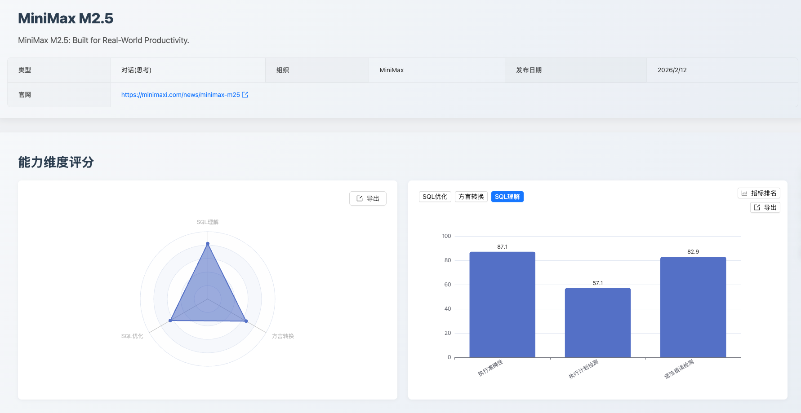
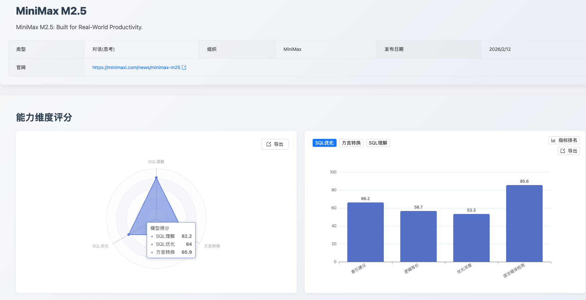
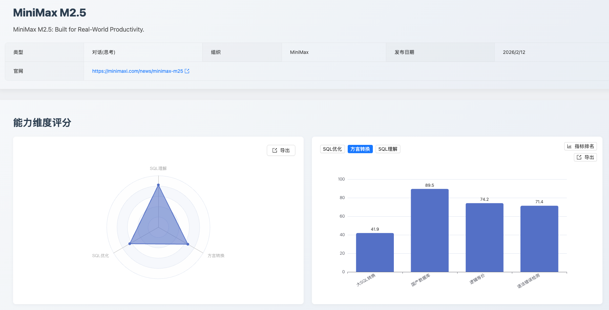

# SCALE 专项测评报告：MiniMax M2.5 模型 SQL 能力深度解析

### 一、评测摘要与核心结论

本次 SCALE 评测针对 MiniMax M2.5 模型进行，旨在系统评估其在企业级数据库场景下的 SQL 综合能力，为用户技术选型提供参考依据。

"精准理解、稳健优化、国产领先"。MiniMax M2.5 在 SQL 语义和语法层面展现出扎实的理解功底，尤其在执行准确性和语法纠错方面达到业界先进水平。在 SQL 优化维度，模型以优化深度第2名的成绩展现了可观的潜力，同时在国产数据库方言转换上的突出表现，为信创迁移场景提供了极具竞争力的解决方案。作为一款均衡型选手，MiniMax M2.5 在多数核心能力上表现稳定，具备较高的实用价值。

MiniMax M2.5 在 SCALE 三大核心维度的综合评分为：SQL理解 82.2分、SQL优化 64.0分、方言转换 65.9分。

### 二、评测方法论

本次评测严格遵循 SCALE 框架的三大核心维度和统一评测数据集，确保结果的公正性与可复现性：

1. **SQL理解**：评估模型对 SQL 语义、执行计划的理解深度，子维度包括执行准确性、执行计划检测、语法错误检测
2. **SQL优化**：评估模型对 SQL 性能优化的识别和改写能力，子维度包括逻辑等价、优化深度、语法错误检测、索引建议
3. **方言转换**：评估模型在不同数据库方言间转换的准确性，子维度包括大SQL转换、国产数据库、逻辑等价、语法错误检测

### 三、维度详细表现与数据洞察

#### 3.1 SQL理解：高分领跑，理解力出众（82.2分）

模型在 SQL理解 维度获得 82.2分，整体表现优秀。

| 子维度 | 得分 | 排名 |
|---|---|---|
| 执行准确性 | 87.1 | 第2名 |
| 执行计划检测 | 57.1 | 第4名 |
| 语法错误检测 | 82.9 | 第6名 |

**优势**：模型在执行准确性上斩获 87.1分（第2名），展现了对 SQL 执行路径选择和语义判断的出色把控力，在所有参评模型中处于领先梯队。语法错误检测 82.9分进一步体现了模型对 SQL 语法规范的精准理解，可有效辅助开发阶段的语法校验。

**待提升**：执行计划检测（57.1分）尚有提升空间，随着模型对数据库优化器行为和执行计划细节的进一步学习，该项能力有望在后续版本中得到显著增强。

#### 3.2 SQL优化：纠错能力突出，优化深度领先（64.0分）

模型在 SQL优化 维度得分 64.0分，在多个子项上展现出亮眼表现。

| 子维度 | 得分 | 排名 |
|---|---|---|
| 逻辑等价 | 56.7 | 第10名 |
| 优化深度 | 53.3 | 第2名 |
| 语法错误检测 | 85.6 | 第5名 |
| 索引建议 | 66.2 | 第6名 |

**优势**：语法错误检测得分高达 85.6分，体现了模型在优化场景下精准识别语法缺陷的强大能力，为改写输出的可靠性提供了坚实保障。尤为值得关注的是，优化深度获得第2名的优异排名，表明模型在深层次 SQL 优化策略的理解和应用上具备显著竞争力。索引建议 66.2分展现了模型在索引优化分析方面的实用价值。

**待提升**：逻辑等价（56.7分）在复杂改写场景下的语义一致性保持方面仍有优化空间，这也是业界多数模型共同面临的技术难点，期待后续迭代中进一步突破。

#### 3.3 方言转换：国产数据库适配能力亮眼（65.9分）

模型在方言转换维度得分 65.9分，呈现出鲜明的差异化优势。

| 子维度 | 得分 | 排名 |
|---|---|---|
| 大SQL转换 | 41.9 | 第9名 |
| 国产数据库 | 88.5 | 第5名 |
| 逻辑等价 | 74.2 | 第5名 |
| 语法错误检测 | 71.4 | 第8名 |

**优势**：国产数据库转换获得 88.5分的高分，充分展现了模型对 OceanBase、GaussDB 等国产数据库方言语法和函数体系的深度适配能力，在信创迁移加速的大背景下，这一能力具有极高的战略价值。逻辑等价 74.2分和语法错误检测 71.4分同样表现稳健，表明模型在跨方言转换中能够可靠地维持业务语义一致性和语法正确性。

**待提升**：大SQL转换（41.9分）在处理超长复杂脚本场景下仍有成长空间，这与当前大语言模型普遍面临的长上下文处理挑战有关，随着上下文窗口技术的持续演进，该项能力有望获得实质性提升。

### 四、应用建议与价值体现

基于 MiniMax M2.5 的能力剖析，我们提供以下应用建议：

*   **开发辅助与 SQL 纠错：强烈推荐。** 模型在语法错误检测（SQL优化维度 85.6分、SQL理解维度 82.9分）和执行准确性（87.1分，第2名）上的亮眼表现，使其成为集成在 IDE 或开发流程中的理想选择，能够为开发者提供高质量的实时 SQL 语法校验和执行语义验证服务。

*   **国产数据库生态迁移：强烈推荐。** 国产数据库方言转换 88.5分的高分是 MiniMax M2.5 最具差异化价值的核心竞争力。在信创政策持续推进的背景下，该模型能够高效赋能 OceanBase、GaussDB 等国产数据库的迁移工作，显著降低迁移成本和技术风险。对于超长复杂脚本建议搭配人工审核以确保万无一失。

*   **SQL 性能优化辅助：推荐。** 模型在优化深度上取得第2名的优异成绩，具备较强的深层优化分析能力。结合语法错误检测的高可靠性，可作为性能优化工作流中的有力辅助工具，帮助团队快速定位优化方向并验证改写方案的语法正确性。

欢迎登录 SCALE 官方平台，查看完整的最新榜单和模型对比详情，共同把握 AI 技术的前沿脉搏。

---

*数据截止时间：2026年2月*
