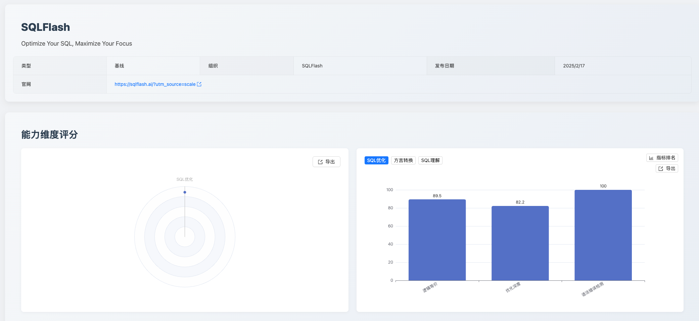
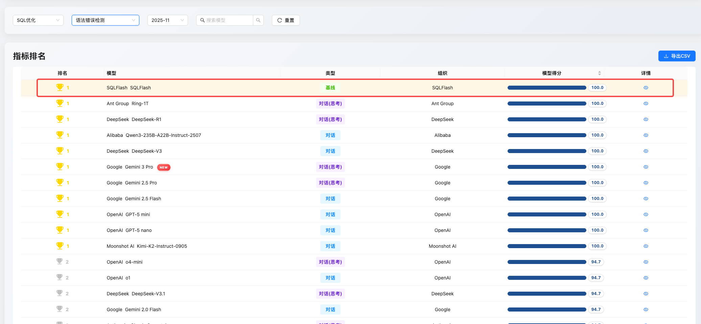
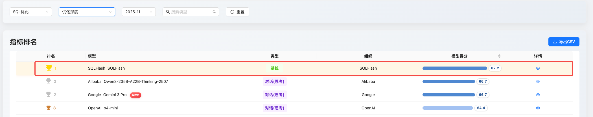
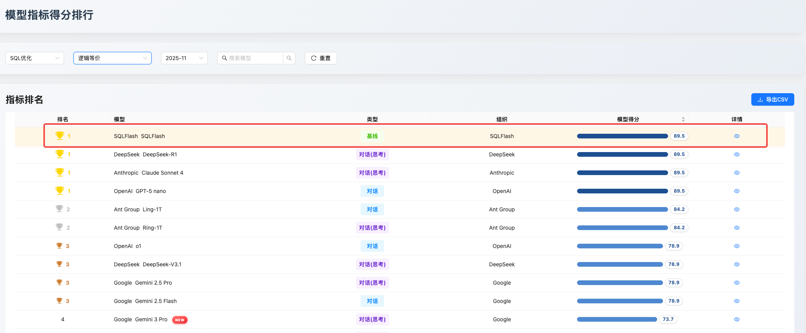

SCALE文档 SQLFlash

SCALE 专项测评报告：SQLFlash 模型在 SQL 优化能力上的表现评估

一、评测摘要与核心结论

本次 SCALE 评测针对专业级 AI 应用 SQLFlash 进行，该模型定位为 SQL 调优专项工具。根据此定位，本次评估维度严格聚焦于 SCALE 框架中的 SQL 优化能力，旨在为企业数据库性能管理提供精准的技术选型依据。

评测结果显示，SQLFlash 在 SQL 优化维度上展现出卓越的工程可靠性和性能优化潜力，其关键指标如下：

点击图片可查看完整电子表格

本次评测结果证实了 SQLFlash 在 SQL 调优领域具备领先能力，可作为 DBA 和资深开发者提升数据库效率、降低代码风险的可靠辅助工具。

二、评测方法论

SQLFlash 被定位为一款专精于 SQL 性能调优的 AI 应用。 为准确反映其核心竞争力，本次评测依据 SCALE 评测框架，仅启用 SQL 优化能力维度，评估其在复杂、低效 SQL 语句重写时的专业表现。

三、SQLFlash 专项能力深度分析

本部分基于 SCALE 评测数据，对 SQLFlash 在各项优化能力指标的表现进行深入分析，旨在验证其在实际应用中的专业价值。

3.1 语法正确性：工程交付的基石

SQLFlash 在 优化后 SQL 语法正确性 指标上达到了 100.0 分的满分表现。

分析： 在 AI 生成代码领域，语法准确性是实现工程化部署的首要前提。此项满分表现，即 100.0% 的准确率，表明 SQLFlash 在其核心功能输出上，在所有测试用例中均保证了语法零错误。这一数据有力佐证了其作为生产环境辅助工具的高度可靠性，显著降低了开发人员在应用优化方案前的验证成本。

3.2 优化深度：复杂优化策略的执行效能

SQLFlash 以 82.2 分的成绩位列 优化深度 榜单榜首。

分析： 优化深度得分量化了模型识别和应用复杂、非显式性能改进策略的能力。该领先分数证实，SQLFlash 具备高效应用高级数据库优化原则的能力，尤其在处理多层嵌套、复杂聚合等查询场景时，体现了将理论优化能力转化为实际系统性能效益的潜力。

3.3 逻辑等价：语义一致性的关键指标

模型在 逻辑等价 指标上取得了 89.5 分的稳健成绩 。

分析： 逻辑等价性是 SQL 代码重构与优化的强制性约束。89.5 分的成绩证明了模型在绝大多数测试场景中，能够精准理解并维持原始 SQL 的业务语义。该数据反映了 SQLFlash 在实现性能优化的同时，对数据完整性和业务逻辑一致性的严格维护。

四、挑战与未来提升方向【@王虎程】

尽管 SQLFlash 在专业维度表现突出，但作为专业级测评报告，我们同时指出其能力边界和未来优化方向：

逻辑等价性提升空间： 89.5 分表明在少数极度复杂的边缘案例中（例如涉及特定数据库版本下的隐式类型转换、或复杂的数据操作语言DML逻辑），仍存在轻微的逻辑理解偏差。进一步将此分数提升至 90% 以上，是确保其在最严苛的金融或核心业务场景中完全可靠的关键。

动态适应性： 100.0 分的语法正确性是基于当前评测数据集和主流数据库版本实现的。未来的挑战在于如何持续训练，使其能够快速且准确地适应数据库厂商不断发布的新 SQL 特性、函数及语法变动，维持其在语法可靠性上的满分优势。

五、应用建议与总结展望

应用建议：

高效率辅助： 推荐将 SQLFlash 集成至 CI/CD 或代码审查流程中，对新增或修改的 SQL 语句进行初级自动化性能扫描，以快速识别并修正性能瓶颈。

可靠性保障： 由于其在语法正确性上的可靠性，可用于直接辅助 DBA 进行中等复杂度的调优任务，减少人工复核基础语法的精力投入。

总结展望：

SQLFlash 凭借其在 SQL 优化领域的专项能力，为数据库性能管理 AI 辅助工具设立了新的可靠性标准。SCALE 评测体系将持续跟踪 SQLFlash 的迭代进展，并通过更具挑战性的混合场景数据集，推动其优化策略向更深层次发展，共同赋能企业数据基础设施的健壮性。

欢迎关注 SCALE 官方平台，探索更多模型详细评测数据。

数据截止时间：2025.12.10